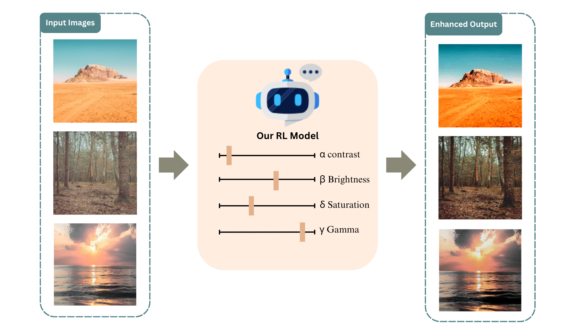
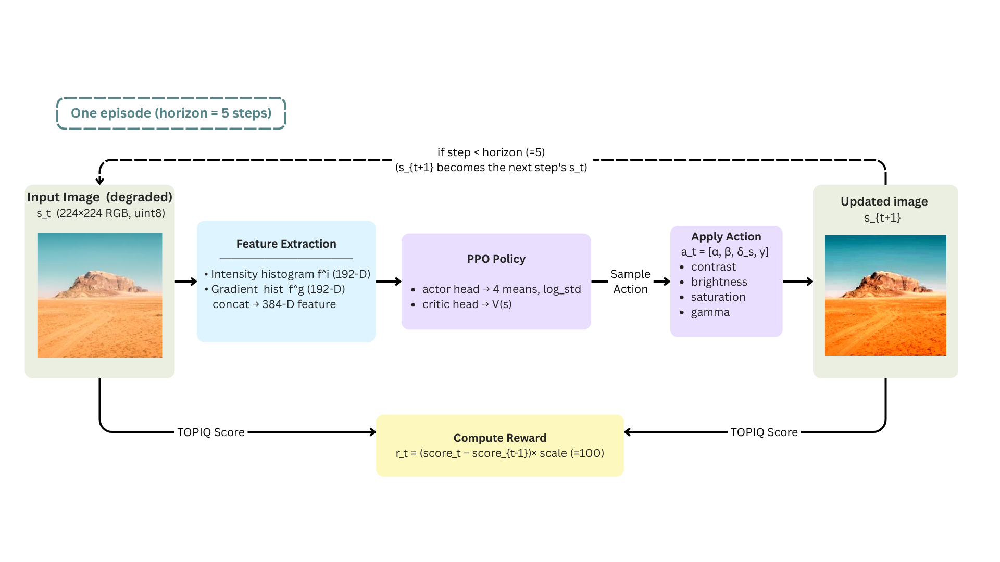

# Reinforcement Learning for Scenic Photo Parameter Adjustment with TOPIQ Reward

**NYCU 535510 Reinforcement Learning — Spring 2026 — Team Project**

🌐 **Project page:** <https://sjtseng0924.github.io/Reinforcement-Learning-for-Scenic-Photo-Parameter-Adjustment-with-TOPIQ-Reward/>

Authors: Hsi-An Chen · Shih-Chen Tseng · Chih-Hsuan Chen

---



## Overview

We enhance scenic photos by training a **PPO agent** to predict four photometric
adjustments — contrast (α), brightness (β), saturation (δ_s), gamma (γ) — guided
by **TOPIQ-NR** (a no-reference image-quality metric) as the reward.

Unlike prior work that requires paired ground-truth images (DRL-ISP) or a
reference style image (StarEnhancer), our pipeline learns purely from a small
set of degraded photos. The reward signal is the per-step change in TOPIQ score,
so there is no labeled dataset to construct.

## Method



Each episode lasts 5 steps. At every step:

1. The current image (`s_t`) is summarised by an **intensity + gradient histogram**
   feature extractor → 384-D state vector.
2. A **PPO MlpPolicy** (actor-critic) maps the state to a 4-D continuous action
   `a_t = [α, β, δ_s, γ]`.
3. The action is applied via OpenCV transforms → updated image `s_{t+1}`.
4. **TOPIQ** scores both images; the reward is
   `r_t = (TOPIQ(s_{t+1}) − TOPIQ(s_t)) × 100`.
5. `s_{t+1}` becomes the input for step `t+1` until horizon = 5.

The reward scaling (×100) brings raw ΔTOPIQ from ~[−0.1, +0.05] to ~[−10, +5],
which makes the value function targets large enough to train cleanly under PPO.

## Repository layout

```
configs/                   PPO + env hyperparameters (yaml)
scripts/                   run_ppo.sh, eval.sh, smoke_test.sh
src/
├── core/                  reward (TOPIQ), transforms (apply_action), seeding
├── env/                   PhotoTuneEnv (Gymnasium), ImageDirDataset
├── features/              HistogramFeatureExtractor
├── agents/                PPO factory (SB3)
├── train/                 train loop + wandb / eval callbacks
└── eval/                  rollout harness, plots, metrics
tools/
└── make_comparison.py     side-by-side before/after image grids
evaluation.py              standalone TOPIQ scorer for any folder
degraded-data/             pre-degraded train / test images
runs/                      training checkpoints (gitignored)
results/                   eval CSVs + enhanced outputs (gitignored)
```

## Quick start

```bash
# Install dependencies (uv + pyproject)
uv sync

# Train PPO (writes to runs/ppo_<timestamp>/, updates runs/latest symlink)
./scripts/run_ppo.sh

# Evaluate the latest model on the held-out test split, then run TOPIQ scoring
./scripts/eval.sh

# Override the checkpoint or test set:
CKPT=runs/some_run/best_model.zip TEST_DIR=path/to/folder ./scripts/eval.sh
```

After eval, `results/<run>/<ckpt>/` contains
the enhanced PNGs, the rollout CSV (`ppo_eval.csv`), and the standalone TOPIQ
scoring CSV (`topiq_scores.csv`).

## Configuration knobs

- `configs/toy_v0.yaml` — env (image dir, action ranges, horizon, reward scale)
- `configs/ppo_default.yaml` — algorithm (learning rate, n_steps, total_timesteps,
  eval / checkpoint cadence)

## Acknowledgements

- TOPIQ via [`pyiqa`](https://github.com/chaofengc/IQA-PyTorch)
- PPO via [`stable-baselines3`](https://github.com/DLR-RM/stable-baselines3)
- MIT-Adobe FiveK as the original photo source
